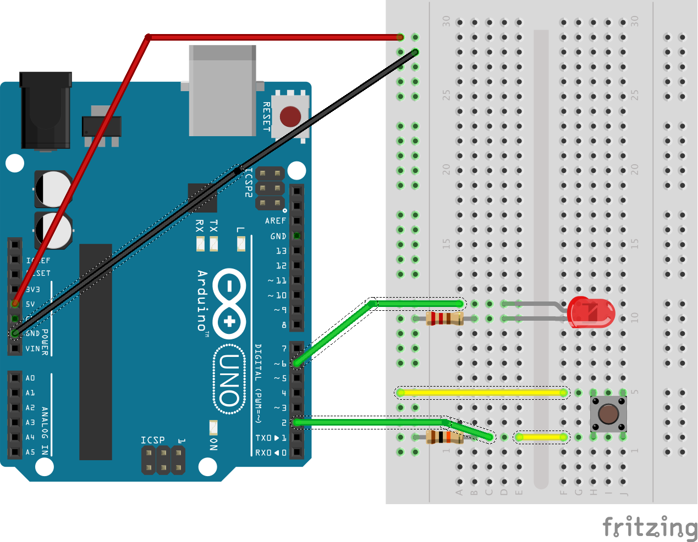

# Arduinode

This is a simple project to create an interface between an Arduino and a Node server.

When you press the button, the light comes on.  

When you pres the button, the Arduino sends the button change information to the server.  The server then sends the Arduino the appropriate response, and the Arduino uses that response to turn the light on or off.

Very simple wiring!

## Usage

* Wire up Arduino
* Connect Arduino and upload project.ino
* Run `npm install` and `npm start`
* Press button

